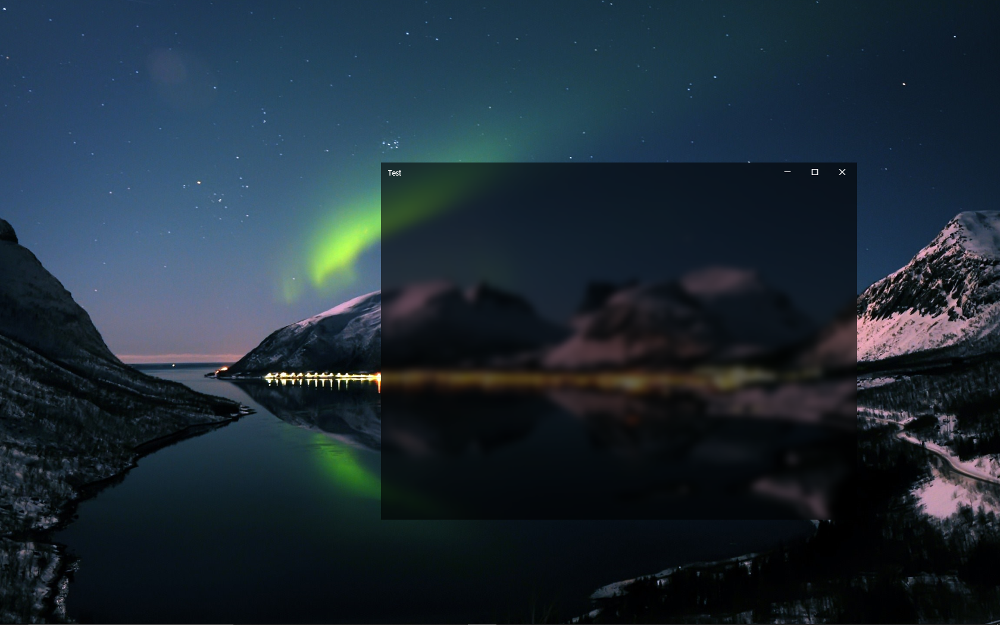

# electron-acrylic-window

 
  
[](https://travis-ci.org/04seohyun/electron-acrylic-window)
[](https://david-dm.org/04seohyun/electron-acrylic-window) 
[](https://badge.fury.io/js/electron-acrylic-window)  

Simply add vibrancy effect to Electron application on Windows.

Works only on Windows 10.

Inspired from ```electron-vibrancy```.

## Download

```shell script
npm i electron-acrylic-window --save
```

## Screenshots


## Usage
### setVibrancy
```javascript
setVibrancy(win);
```
Enables Vibrancy to window.  
There is no return value. If it fails to set vibrancy, it throws error.  
```win``` should be frameLess, and transparent.

Errors
* NOT_MATCHING_PLATFORM  
Error that occurs when os is not Windows 10.
* WINDOW_NOT_GIVEN  
Error that occurs when ```win``` parameter is not passed.
* NOT_VALID_WINDOW   
Error that occurs when ```win``` parameter is not valid Electron window.
* FAIL_LOAD_DLL  
Error that occurs when fails to load SetWindowCompositionAttribute from user32.dll
* UNKNOWN  
Unknown error.

### disableVibrancy
```javascript
disableVibrancy(win);
```
Disables Vibrancy to window.  
There is no return value. If it fails to disable vibrancy, it throws error.  
```win``` should be frameLess, and transparent.

Errors
* NOT_MATCHING_PLATFORM  
Error that occurs when os is not Windows 10.
* WINDOW_NOT_GIVEN  
Error that occurs when ```win``` parameter is not passed.
* NOT_VALID_WINDOW   
Error that occurs when ```win``` parameter is not valid Electron window.
* UNKNOWN  
Unknown error.


## Example
```javascript
const vibrancy = require('electron-acrylic-window');
const {app, BrowserWindow} = require('electron');

let win;

function createWindow() {
    win = new BrowserWindow({
        width: 800,
        height: 600,
        frame: false,
        transparent: true
    });
    win.loadURL(`file://${__dirname}/index.html`);
    vibrancy.setVibrancy(win);
}

app.on('ready', createWindow);

```