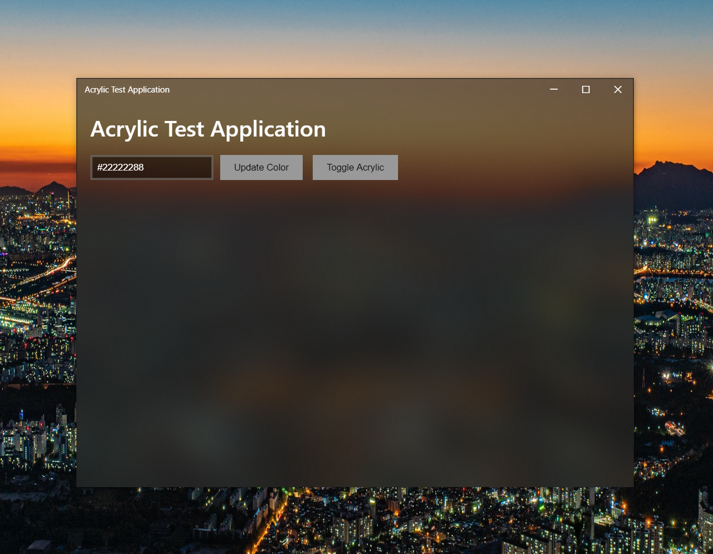
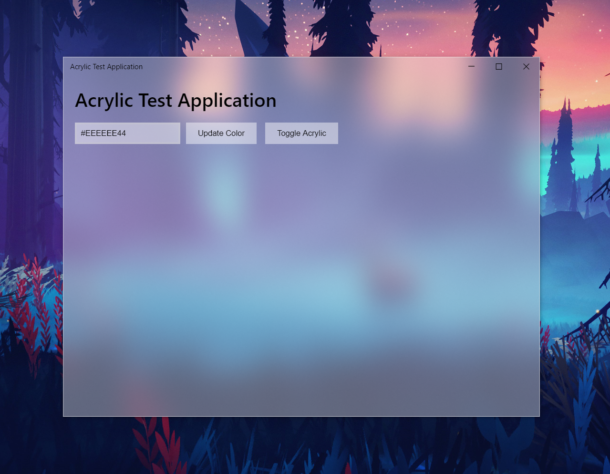

<p align="center"></p>

<h1 align="center">electron-acrylic-window</h1>

[](https://github.com/Seo-Rii/electron-acrylic-window/actions/workflows/windows.yml)

[](https://badge.fury.io/js/electron-acrylic-window)

Makes it simple to add the Windows 10 Acrylic effect to Electron applications, by acting as a wrapper for the standard Electron vibrancy feature.

Only affects Windows 10. If the OS is not Windows 10, it will fall back on the original vibrancy function.

Inspired by [electron-vibrancy](https://github.com/arkenthera/electron-vibrancy).



## Contributors

Huge thanks to all contributors!
<a href="https://github.com/Seo-Rii/electron-acrylic-window/graphs/contributors">

</a>

## Installation

You will need Visual Studio or Visual C++ build tools to install this. An easy way to install them can be found [here](https://www.npmjs.com/package/windows-build-tools).

```shell script
yarn add electron-acrylic-window
```

## Usage

### `BrowserWindow` - Wrapper class for `electron.BrowserWindow`

Enables Vibrancy on the Electron window.

```js
const {BrowserWindow} = require("electron-acrylic-window");

win = new BrowserWindow({
    ...,
    frame: false,
    vibrancy: [options] // See below
});
```

If OS is Windows 10, it overrides the constructor option and `BrowserWindow.setVibrancy` method to work properly on Windows 10. If OS is not Windows 10, it will work normally.

### `setVibrancy` - Wrapper function for `electron.BrowserWindow.setVibrancy`

Enables Vibrancy on the Electron window.

```js
const { setVibrancy } = require('electron-acrylic-window')

setVibrancy(win, [options])

// OR

win.setVibrancy([options])
```

`win` should be frameless.

Will call original `win.setVibrancy(op)` Electron function if OS is not Windows 10.

There is no return value. If it fails to set vibrancy, it throws an error.

#### Errors

-   `WINDOW_NOT_GIVEN` - Error that occurs when `win` parameter is not passed.
-   `NOT_VALID_WINDOW` - Error that occurs when `win` parameter is not valid Electron window.
-   `FAIL_LOAD_DLL` - Error that occurs when fails to load SetWindowCompositionAttribute from user32.dll
-   `UNKNOWN` - Other error.

### Options

If OS is not Windows 10, `[options]` will be passed on to the original vibrancy function/option, so keep that in mind.

On Windows 10, `[options]` should be a String or an Object.

-   **String**

    Should be `'light'`, `'dark'`, `'appearance-based'` or a hex color code with alpha (`'#222222aa'`).
    Default is `'appearance-based'`.

-   **Object**

    ```javascript
    op = {
       theme: String ( = 'appearance-based'),
       effect: String ( = 'acrylic'),
       useCustomWindowRefreshMethod: Boolean ( = true),
       maximumRefreshRate: Number ( = 60),
       disableOnBlur: Boolean ( = true)
    }
    ```

    -   `theme` - String (optional)

        Sets color of acrylic effect. Can be `'light'`, `'dark'`, `'appearance-based'` or a hex color code with alpha (`'#222222aa'`). Default is `'appearance-based'`

    -   `effect` - String (optional)

        Sets the type of Windows transparency effect, either `'acrylic'` or `'blur'`. Default is `'acrylic'`.

        > **Setting this option to acrylic may cause performance degradation. Acrylic only works on Windows 10 RS3 or above, otherwise `'blur'` is forced.**

    -   `useCustomWindowRefreshMethod` - Boolean (optional)

        Use custom window resize/move handler for performance. Default is `true`.

        Special thanks to [@djsweet](https://github.com/djsweet) and [@xanderfrangos](https://github.com/xanderfrangos).

        > **This is an experimental feature. May cause errors.**

    -   `maximumRefreshRate` - Number (optional)

        Maximum refresh rate of the application, in hertz. Default is `60`.

    -   `disableOnBlur` - Boolean (optional)

        If true, acrylic effect will be disabled when the window loses focus, to mimic the behaviour of normal UWP apps. Default is `true`.

    -   `debug` - Boolean (optional)

        If true, log will be printed to console.

## Demo

To run the demo Electron application, clone this repository, install the dependencies and run the test script:

```bash
git clone https://github.com/Seo-Rii/electron-acrylic-window.git
cd electron-acrylic-window
yarn install
yarn run test
```
